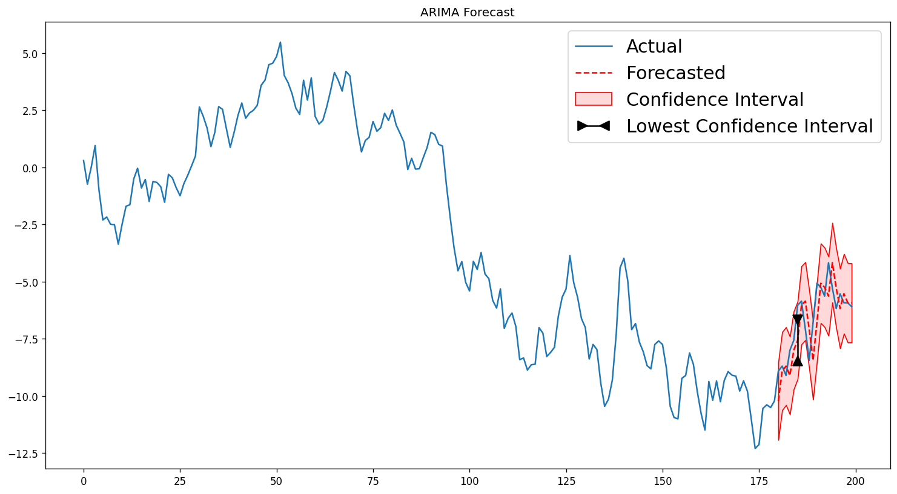
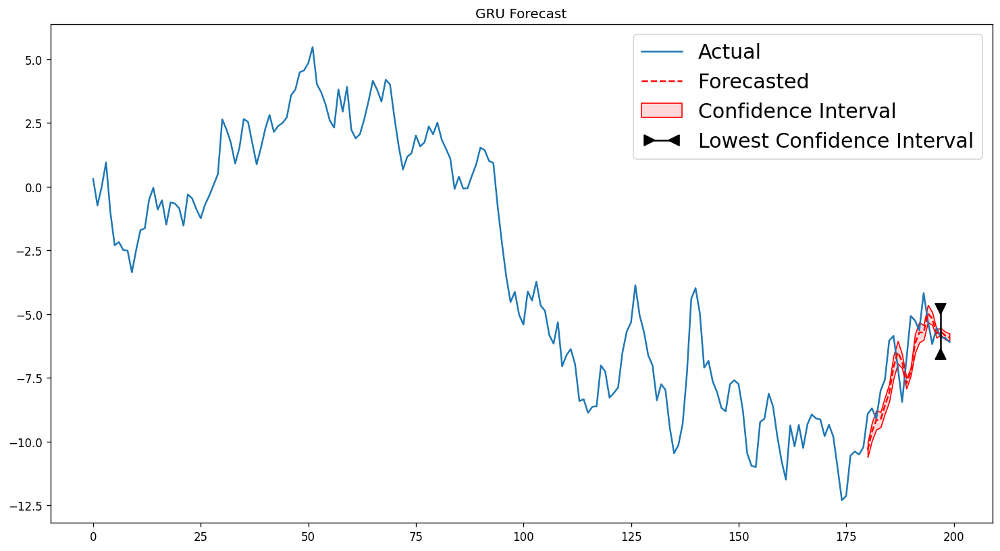
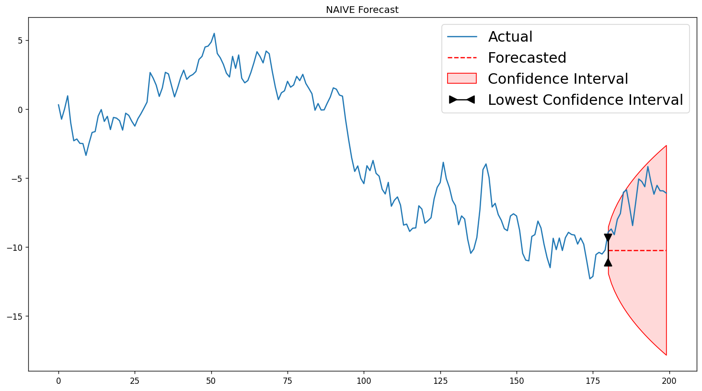
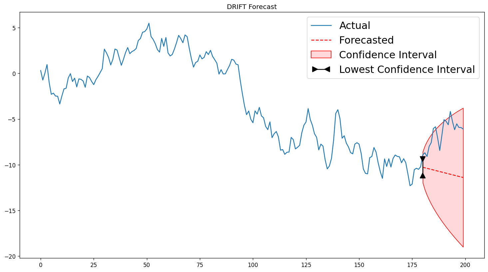

# LazyForecast

LazyForecast is a Python library for univariate time series forecasting. It automatically fits
multiple models to your data, ranks them by accuracy, and returns the best forecast — no manual
model selection or parameter tuning required.

[](https://github.com/piyushsinghoffice/LazyForecast/actions/workflows/ci.yml)
[](https://pypi.org/project/lazyforecast/)
[](https://pypi.org/project/lazyforecast/)

## Table of Contents

- [Installation](#installation)
- [What's new in v0.2.0](#whats-new-in-v020)
- [Models](#models)
- [Quick Start](#quick-start)
- [API Reference](#api-reference)
- [Output](#output)

---

## Installation

```bash
pip install lazyforecast
```

Requires Python ≥ 3.9 and PyTorch ≥ 2.0.

---

## What's new in v0.2.0

| Feature | Summary |
|---|---|
| **Baseline models** | Naive, Seasonal Naive, and Drift forecasters — auto-included in every comparison |
| **Rolling-origin CV** | `lf.fit(cv="rolling", n_splits=5, horizon=14)` — per-fold + aggregated metrics |
| **Conformal intervals** | `lf.fit(interval="conformal", alpha=0.1)` — model-agnostic, coverage-valid CIs |
| **DatetimeIndex support** | Forecast index automatically extended when input has a datetime index |
| **`result.save(path)`** | Writes `config.json`, `metrics.csv`, `forecast.csv`, `intervals.csv`, `plot.png` |
| **Coverage metric** | Empirical interval coverage always shown in the evaluation table |

---

## Models

LazyForecast trains all of the following models and ranks them on the held-out test window:

| Model | Type |
|---|---|
| ARIMA | Classical statistical (auto-selected order via `pmdarima`) |
| MLP | Multi-layer perceptron (PyTorch, 2 × 64 hidden) |
| VANILLA LSTM | Single-layer LSTM (PyTorch) |
| STACKED LSTM | Two-layer LSTM (PyTorch) |
| BIDIRECTIONAL LSTM | Bidirectional LSTM (PyTorch) |
| RNN | Vanilla RNN (PyTorch) |
| GRU | Gated Recurrent Unit (PyTorch) |
| **NAIVE** | Flat forecast at last observed value |
| **SEASONAL NAIVE** | Last value from same season in prior cycle |
| **DRIFT** | Linear extrapolation from first to last training observation |

Deep models use ensemble learning (multiple independently-initialised models) and return
confidence intervals from the spread of ensemble predictions.

---

## Quick Start

```python
import numpy as np
import pandas as pd
import matplotlib.pyplot as plt
from lazyforecast import LazyForecast

# Any pd.Series, pd.DataFrame, or np.ndarray works
series = pd.Series(np.cumsum(np.random.default_rng(42).normal(0, 1, 200)))

lf = LazyForecast(
    n_periods=20,      # forecast horizon / test window
    n_steps=10,        # lookback window for deep models
    n_members=5,       # ensemble size per deep model
    random_state=42,   # reproducible results
    epochs=200,
    season_length=12,  # for Seasonal Naive (12 = monthly, 7 = weekly, …)
)

result = lf.fit(series)

print(result.eval_table)   # ranked metrics for all 10 models
print(result.best_model)   # name of the top-ranked model

fig = lf.plot()            # forecast chart — best model
plt.show()
```

### Using a DataFrame

```python
import yfinance as yf

df = yf.download("GOOGL", start="2021-01-01", end="2022-12-31")
result = lf.fit(df, target_col="Close")
```

### DatetimeIndex — index preserved automatically

```python
import pandas as pd

# Monthly series with a DatetimeIndex
idx = pd.date_range("2018-01-01", periods=60, freq="MS")
s = pd.Series(values, index=idx)

result = lf.fit(s)
print(result.forecast_index)  # DatetimeIndex: 2023-01-01 … 2023-08-01
```

### Rolling-origin cross-validation

```python
cv = lf.fit(series, cv="rolling", n_splits=5, horizon=20)

print(cv.mean_metrics)   # averaged metrics across 5 folds
print(cv.std_metrics)    # metric stability across folds
print(cv.fold_metrics)   # list of per-fold eval DataFrames
```

### Conformal prediction intervals

```python
# Replace model CIs with split-conformal intervals (90% coverage target)
result = lf.fit(series, interval="conformal", alpha=0.1)
# result.confidence now contains [ŷ - q̂, ŷ + q̂] for every model
```

### Save all artifacts to disk

```python
result.save("runs/experiment_01/")
# Creates:
#   runs/experiment_01/config.json
#   runs/experiment_01/metrics.csv
#   runs/experiment_01/forecast.csv
#   runs/experiment_01/intervals.csv
#   runs/experiment_01/plot.png
```

### Plotting a specific model

```python
fig = lf.plot(model_name="GRU")
fig.savefig("gru_forecast.png")
```

### Standalone plot function

```python
from lazyforecast import plot_forecast

fig = plot_forecast(
    data=series,
    fc=result.predictions["ARIMA"],
    confint=result.confidence["ARIMA"],
    model_name="ARIMA",
    n_periods=20,
)
```

---

## API Reference

### `LazyForecast(...)`

| Parameter | Default | Description |
|---|---|---|
| `n_periods` | 5 | Forecast horizon (test window size) |
| `n_steps` | 5 | Lookback window for deep models |
| `n_members` | 10 | Ensemble size per deep model |
| `random_state` | `None` | Seed for reproducibility |
| `device` | `None` | `'cpu'` or `'cuda'` (auto-detects) |
| `epochs` | 200 | Training epochs per ensemble member |
| `batch_size` | 32 | DataLoader batch size |
| `lr` | 1e-3 | Adam learning rate |
| `verbose` | `False` | Print training progress |
| `season_length` | 12 | Seasonal period for Seasonal Naive |

### `.fit(data, target_col=None, cv=None, n_splits=5, horizon=None, step=None, interval=None, alpha=0.1)`

Trains all models on `data[:-n_periods]` and evaluates on `data[-n_periods:]`.

| Parameter | Description |
|---|---|
| `data` | `pd.Series`, `pd.DataFrame`, or `np.ndarray` |
| `target_col` | Required when `data` is a `DataFrame` |
| `cv` | `"rolling"` → rolling-origin CV; returns `CVResult` |
| `n_splits` | Number of CV folds |
| `horizon` | CV test horizon (defaults to `n_periods`) |
| `step` | Gap between CV fold cutpoints (None = auto) |
| `interval` | `"conformal"` → replace CIs with split-conformal intervals |
| `alpha` | Miscoverage level for conformal (default 0.1 → 90% target) |

Returns a `ForecastResult` with:

| Attribute | Type | Description |
|---|---|---|
| `eval_table` | `pd.DataFrame` | All models ranked best-first (includes `coverage`) |
| `predictions` | `dict[str, np.ndarray]` | Point forecasts per model |
| `confidence` | `dict[str, np.ndarray]` | `(n_periods, 2)` intervals per model |
| `best_model` | `str` | Name of the top-ranked model |
| `forecast_index` | `pd.Index \| None` | Extended DatetimeIndex (or `None`) |
| `training_data` | `pd.Series \| None` | Original series (used by `save()` / `plot()`) |

When `cv="rolling"` is requested, returns a `CVResult` instead:

| Attribute | Type | Description |
|---|---|---|
| `fold_metrics` | `list[pd.DataFrame]` | Per-fold evaluation tables |
| `mean_metrics` | `pd.DataFrame` | Metrics averaged across folds |
| `std_metrics` | `pd.DataFrame` | Metric standard deviation across folds |
| `n_splits` | `int` | Number of folds actually computed |
| `horizon` | `int` | Forecast horizon used per fold |

### `.plot(model_name=None) → Figure`

Returns a `matplotlib.figure.Figure`. `model_name=None` plots the best model.

### `.predict(data, target_col=None) → (forecasts, confidence)`

Re-runs the best model on new data. Requires `fit()` to have been called first.

### `ForecastResult.save(path)`

Persists all artifacts to `path/`. Creates the directory if it does not exist.
Overwrites any existing files.

---

## Output

### Evaluation Table

The table is sorted best-first by: MDA ↓, RMSE ↑, MAPE ↑, R² ↓, MAE ↑.
`coverage` reports the empirical fraction of test-set actuals inside the model's
confidence interval.

```
                         mda      rmse      mape        R2       mae      corr  coverage
model
ARIMA               0.526316  0.993165  0.131736  0.490248  0.819499  0.796717      1.00
GRU                 0.526316  1.094003  0.142097  0.381480  0.884138  0.785354      0.20
RNN                 0.526316  1.170548  0.160381  0.291899  0.961421  0.759449      0.00
MLP                 0.526316  1.189024  0.153032  0.269369  0.955438  0.801338      0.50
STACKED LSTM        0.526316  1.223713  0.157234  0.226115  0.967921  0.765833      0.40
DRIFT               0.526316  4.570388  0.728949 -9.795008  4.260735 -0.726026      0.80
BIDIRECTIONAL LSTM  0.473684  1.045850  0.137287  0.434730  0.845828  0.804615      0.20
VANILLA LSTM        0.473684  1.359355  0.181296  0.045046  1.100711  0.765476      0.15
SEASONAL NAIVE      0.315789  4.237147  0.645924 -8.278204  3.765564 -0.203130      0.85
NAIVE               0.000000  3.900010  0.623546 -6.860466  3.643497       NaN      0.95
```

### Rolling CV — mean metrics across 5 folds

```
                         mda      rmse      mape         R2       mae  coverage
model
ARIMA               0.488889  0.878992  0.174419  -0.371822  0.756304      0.98
MLP                 0.466667  1.544405  0.350981  -5.070491  1.342785      0.26
RNN                 0.466667  1.785267  0.360808  -9.559578  1.590230      0.34
DRIFT               0.622222  1.933209  0.492840  -3.502127  1.681359      0.92
NAIVE               0.000000  1.957013  0.461153  -3.572559  1.714646      0.92
GRU                 0.377778  1.749812  0.369425  -8.019596  1.573216      0.06
STACKED LSTM        0.377778  2.021879  0.447186  -8.758271  1.770432      0.00
BIDIRECTIONAL LSTM  0.377778  2.042200  0.431923 -10.605202  1.818141      0.10
VANILLA LSTM        0.422222  2.146881  0.438997 -11.635326  1.932178      0.04
SEASONAL NAIVE      0.422222  2.841445  0.533816 -23.113545  2.489917      0.66
```

### Sample Forecast Charts

#### ARIMA


#### GRU


#### Naive baseline


#### Drift baseline

